# R7 Sprint 18: Tokens and component kit

## Branches

- Source: `feature/r7-sprint-18-design-system-kit`
- Target: `dev`

## Scope

Release R7 (design system and application shell), Sprint 18. Closes `UI-01`
to `UI-04`. No screen changes: the V1 application runs unchanged; the design
system, the libraries and the development-only gallery are added next to it
(ADR-V2-003 step 1). This branch also carries the R6 release-notes commits so
it merges cleanly after them.

## Summary

- Screens rebuilt: none (by design).
- Components added: every primitive of `05_FRONTEND_DESIGN_SYSTEM.md`
  section 3.1 (34 in `src/components/ui`) and every pattern of section 3.2
  (21 in `src/components/patterns`), each with a `.module.css`, a `.test.tsx`
  and a `.example.tsx` registered in the `/_kit` gallery. A test derives the
  expected list from the component folders and from the catalogue, so a
  missing example or a missing component fails the build.
- API endpoints consumed: none at runtime. `lib/api/client.ts` targets
  `/api/v1` only; the msw handlers mirror `GET /auth/me`, `POST /auth/login`,
  `POST /auth/logout` and the catalogue product routes as the pattern for
  later modules.
- V1 files deleted: none. One V1 file changed: `src/main.tsx` gained a
  development-only branch that mounts the gallery on `/_kit`; it is removed
  from production bundles by the `import.meta.env.DEV` guard (the build
  output has no gallery chunk).

### Deliverables by requirement

| ID    | Delivered                                                                                                                                                                                                                                                                                                                                                                                                                                                                                                                  |
| ----- | -------------------------------------------------------------------------------------------------------------------------------------------------------------------------------------------------------------------------------------------------------------------------------------------------------------------------------------------------------------------------------------------------------------------------------------------------------------------------------------------------------------------------- |
| UI-01 | `src/styles/tokens.css` with the brand primitives, semantic colours, typography, spacing, radius, shadows, motion, layout and z-index tokens; `reset.css`; `base.css` (body, headings, links, focus ring, `tabular-nums`, `eyebrow`, `visually-hidden`); `index.html` loads Inter 400 to 700 and Fraunces 600 italic with `preconnect`, favicons at 32, 180 and 512 px from the logo, `theme-color` `#173f6d` and a description                                                                                            |
| UI-02 | Primitives: Button, IconButton, Badge, StatusPill, Card, FormField, TextInput, TextArea, NumberInput, MoneyInput, QuantityInput, DateInput, DateTimeInput, Select, Combobox, Checkbox, Switch, RadioGroup, SegmentedControl, Dialog, Sheet, ConfirmDialog, DropdownMenu, Tooltip, Toast (+ `useToast`, Zustand queue), Skeleton, EmptyState, ErrorState, Avatar, Tabs, Progress, Spinner, Kbd, VisuallyHidden                                                                                                              |
| UI-03 | Patterns: AppShell (static, sidebar with rail, top bar, bottom nav, `Plus` sheet), PageHeader, FilterBar, DataTable (server-driven, TanStack headless, card mode), DetailPanel, KeyValueList, KpiTile, KpiGrid, BarChart, Sparkline, RankedList, Timeline, StatementTable, LineEditor, TotalsCard, PaymentBox, PermissionGate, FormDialog, ConfirmPostingDialog, SessionBanner, StockBadge                                                                                                                                 |
| UI-04 | `lib/api` (client, `ApiError`, idempotency key, pagination), `lib/auth` (`PermissionKey` union generated from the backend catalogue by `npm run api:permissions`, `hasPermission`, `hasAny`, `hasAll`), `lib/forms` (`decimalString`, `tnd`, `quantity`, `phone`, `requiredString`, `applyFieldErrors`), `lib/hooks` (`useDebounce`, `useMediaQuery`, `useBreakpoint`, `useUrlState`, `useConfirm`), `i18n` (`fr.ts` dictionary seeded with the V1 vocabulary table, `errors.ts` covering every backend code, `format.ts`) |

Tooling: `eslint-plugin-react-hooks` and `eslint-plugin-jsx-a11y` on the V2
code, `stylelint` with `color-no-hex` outside `tokens.css`, `npm run lint`
at the root runs both; vendor chunks, a treemap bundle report
(`dist/bundle-report.html`) and `scripts/check-bundle-size.mjs` in the
frontend build; msw server, handlers, factories and a viewport helper for
tests.

## Out of Scope

- Routing, session, any page, any V1 screen change (Sprint 19).
- Playwright end-to-end flows (Sprint 19); the package is installed here only
  to drive the gallery review script.
- The desktop popover calendar for `DateInput` and `DateTimeInput`: both use
  the native pickers at every width. Recorded as a deviation from
  `05` section 3.1; a calendar without a library is deferred to the settings
  and polish sprints.
- Dark mode (`OD-V2-003`, default applied).

## Verification

Run locally on macOS, Node 24.15.0:

- `npm run format:check`: passed
- `npm run lint` (ESLint with hooks and a11y rules, then stylelint): passed,
  zero warnings; no hex outside `tokens.css` (AS-V2-11)
- `npm run typecheck`: passed, backend and frontend
- `npm run test --workspace frontend`: 125 passed (64 files), including the
  3 V1 `App.test.tsx` tests, so the old app is unchanged
- `npm run build --workspace frontend`: passed; initial JavaScript 92.3 kB
  gzip against the 250 kB budget; no gallery chunk in the output
- `npm run kit:review` (Playwright driving the system Brave browser, since
  Playwright no longer ships a Chromium for macOS 13): passed at 360, 430,
  768 and 1280 px

### AS-V2-10 gallery review

`frontend/scripts/kit-review.mjs` opens `/_kit?embed=1` at the four widths
in a headless Chromium, counts the sections, asserts that the page has no
horizontal scroll (`scrollWidth` equals `clientWidth`, ignoring content
clipped inside scroll containers), opens the first dialog and tabs six times
to prove focus stays trapped, then writes full-page and per-section captures.
Result of the final run:

| Width   | Components | Page width  | Dialog focus trap | Result |
| ------- | ---------- | ----------- | ----------------- | ------ |
| 360 px  | 55         | 360 / 360   | held              | pass   |
| 430 px  | 55         | 430 / 430   | held              | pass   |
| 768 px  | 55         | 768 / 768   | held              | pass   |
| 1280 px | 55         | 1280 / 1280 | held              | pass   |

The first runs found three real overflows, all fixed before this result:
the gallery grid let a table's minimum width push the page to 734 px
(`minmax(0, 1fr)` on the grid columns), and two example rows (sparklines,
icon buttons) did not wrap. Every component state listed in the design
system is rendered by its example (`KitPage.test.tsx` fails when a folder
has no example or the catalogue has no folder).

## UX acceptance checklist

Not applicable to a component sprint: `09_UX_ACCEPTANCE_CHECKLIST.md` is
executed per screen from Sprint 19. Sections B (tokens only, stylelint), D
(screen states exist as components) and F (labels, focus, dialogs trap
focus, reduced motion) are covered by the component tests and the review
script.

## Screenshots

Section crops from the review run, committed under `prs/assets/023-kit/`
(full-page captures are 30 000 px tall and stay local).

| Section       | 360 px                                            | 1280 px                                            |
| ------------- | ------------------------------------------------- | -------------------------------------------------- |
| Button        | 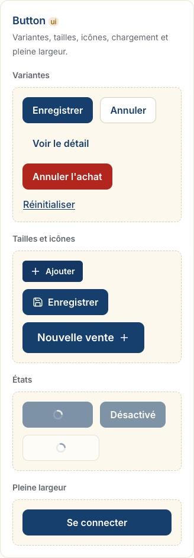        | 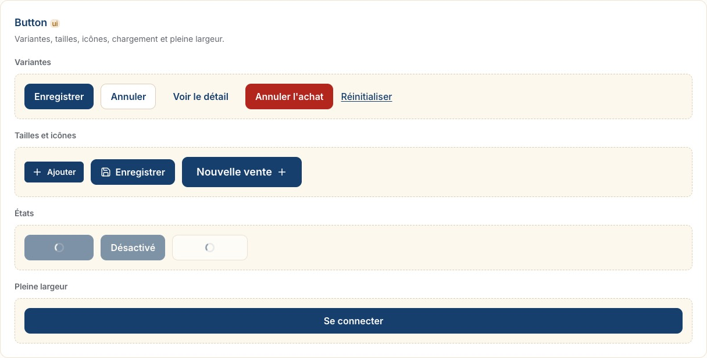        |
| FormField     | 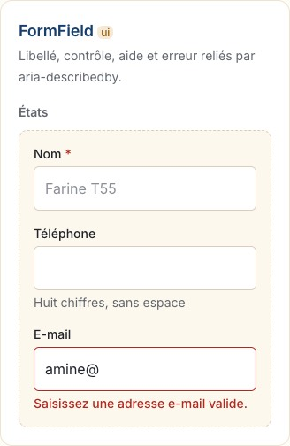     | 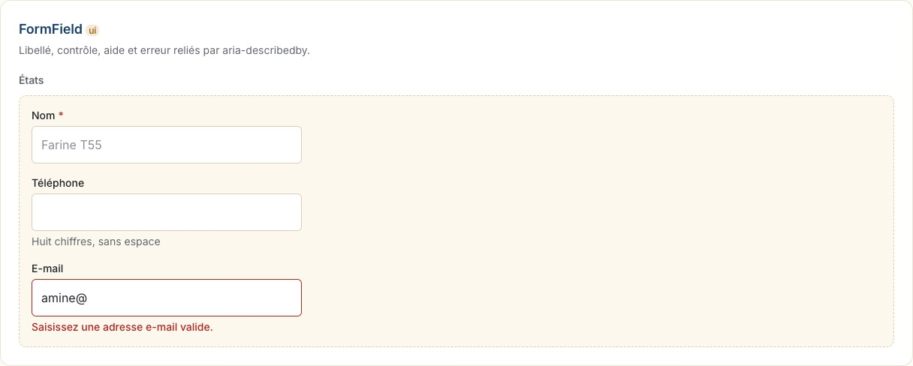     |
| DataTable     | 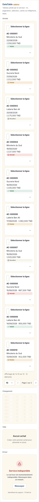     | 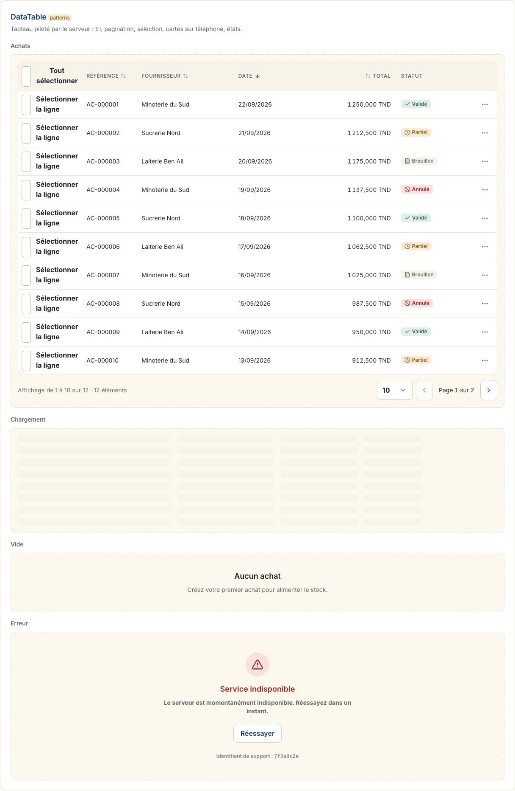     |
| KpiTile       | 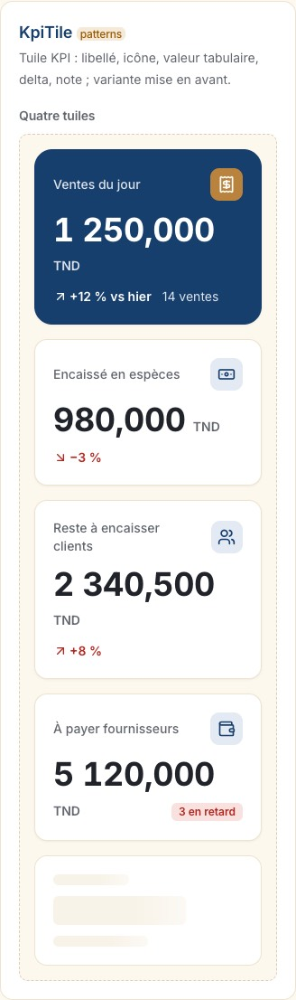       | 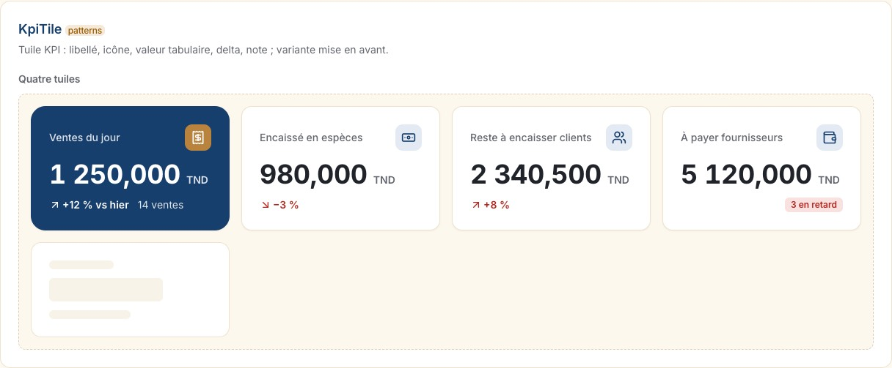       |
| AppShell      | 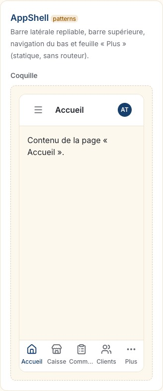      | 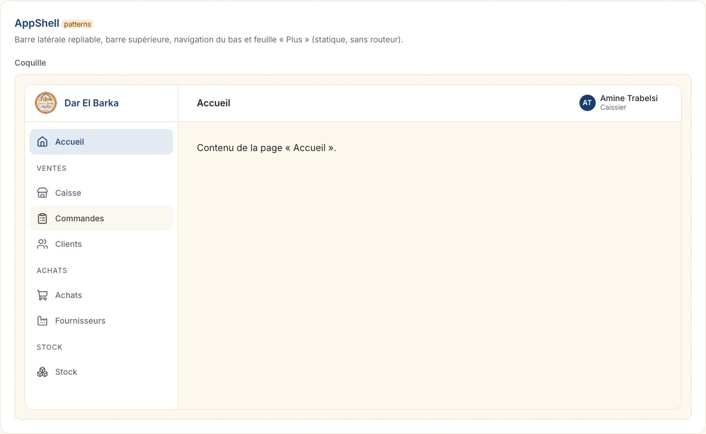      |
| ConfirmDialog |  | 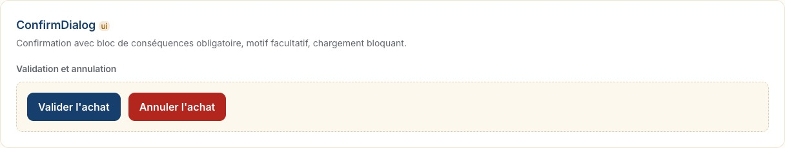 |

## Database and Migration Impact

None.

## Environment Impact

`VITE_API_V1_BASE_URL` is read by the new API client when set; otherwise it
derives `/v1` from the existing `VITE_API_BASE_URL`, and falls back to
`/api/v1`. No secrets.

## Risks and Follow-Up

- Two test assertions are adapted to jsdom: focus restoration to the opener
  after a dialog closes, and radio selection on arrow keys, which Radix
  performs on browser key timing. The Sprint 19 Playwright smoke test covers
  both in a real browser.
- `useUrlState` depends on `react-router-dom`, which is installed but not
  wired until Sprint 19; the hook is unit-tested inside a memory router.

## Merge Checklist

- [ ] CI passed
- [x] No real `.env` files or secrets committed
- [x] Scope matches the sprint
- [x] Screen specs marked Implemented (none in this sprint)
- [x] `12_SPRINT_STATUS_V2.md` and `CHANGELOG.md` updated
- [x] Target branch is `dev`
