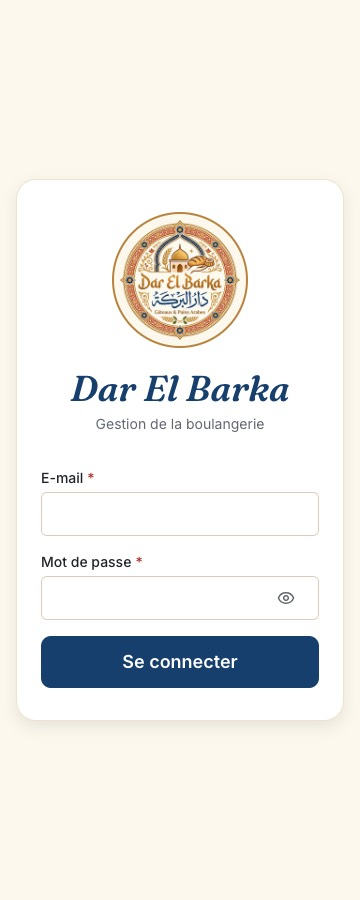
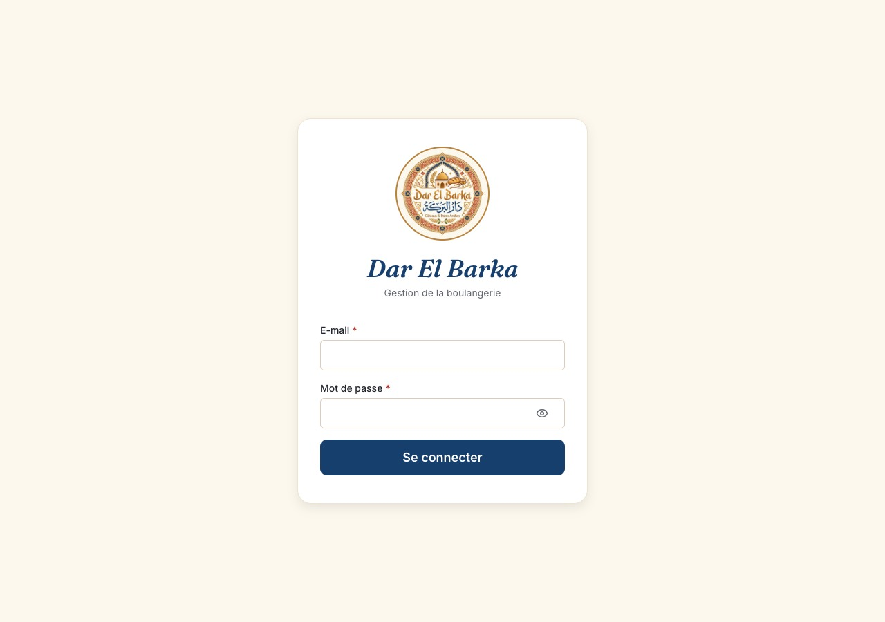
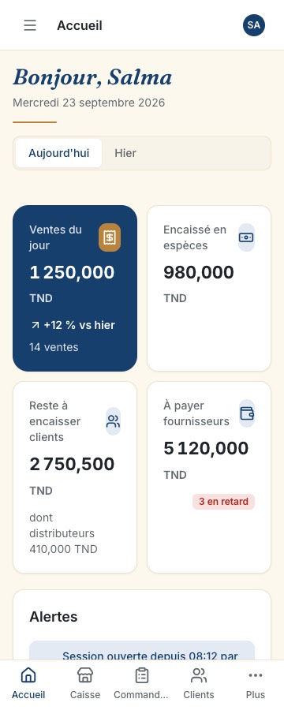
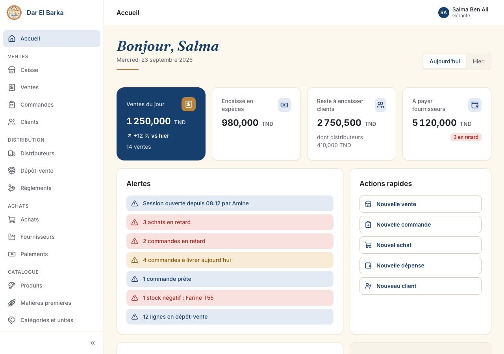
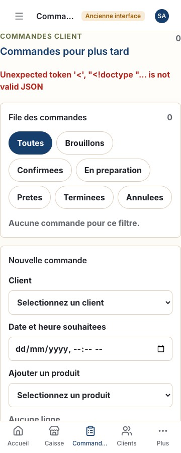
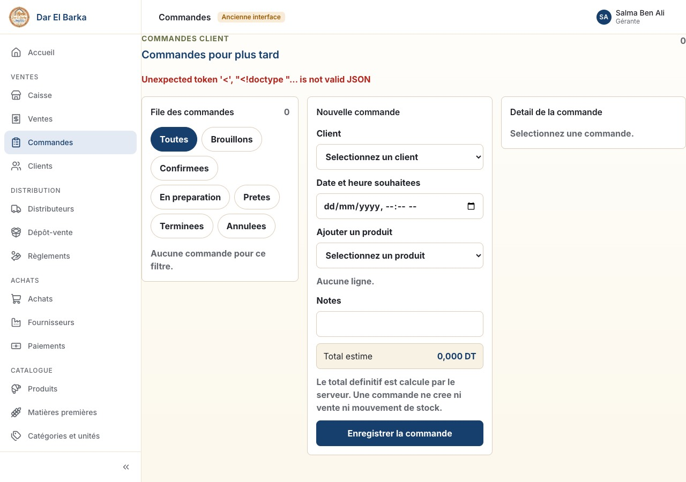

# R7 Sprint 19: Shell, authentication, navigation, Accueil

## Branches

- Source: `feature/r7-sprint-19-shell-auth-accueil`
- Target: `dev`

## Scope

Release R7 (design system and application shell), Sprint 19. Closes `UI-05`
to `UI-09`. The application now boots into the new shell: brand login,
permission-driven sidebar and bottom navigation, the `Accueil` page with
live figures, and every V1 screen reachable at its new French route inside
the shell (ADR-V2-003 step 2). One additive backend change: the session
payload gains role names and the session expiry.

## Summary

- Screens rebuilt: `Connexion` (`/connexion`), `Accueil` (`/`), the shell
  around every route, the not-found and access-denied pages.
- Components added or changed: `app/router.tsx` (browser router, lazy
  route groups, guards), `app/nav.ts` (the manifest of 07 section 2),
  `app/ProtectedLayout.tsx` (session bootstrap, splash, redirect with `next`,
  shell wiring, expiry toast), `lib/auth/session.ts` (`useSession`,
  `useLogin`, `useLogout` over React Query), `lib/auth/RequirePermission.tsx`,
  `features/auth/LoginPage.tsx`, `features/home/*` (API, query, period,
  widgets, page), `features/legacy/*` (V1 screen wrapper and route table),
  `features/shell/*` (splash, not found, denied). `KpiTile` figures now size
  with their tile and never wrap inside a number (found by the screen review).
- API endpoints consumed (all under `/api/v1`): `GET /auth/me`,
  `POST /auth/login`, `POST /auth/logout`, `GET /home/summary`. The V1
  screens keep calling the legacy `/api` prefix through their own clients.
- V1 files deleted: `features/shell/ProtectedShell.tsx`,
  `features/auth/LoginForm.tsx`. `app/App.tsx` and `main.tsx` are rewritten.
  `features/auth/authApi.ts` stays because the V1 screens import its
  `CurrentUser` type.

### Deliverables by requirement

| ID    | Delivered                                                                                                                                                                                                                                                                                                                                                                                                                                                                               |
| ----- | --------------------------------------------------------------------------------------------------------------------------------------------------------------------------------------------------------------------------------------------------------------------------------------------------------------------------------------------------------------------------------------------------------------------------------------------------------------------------------------- |
| UI-05 | Router with French paths, one lazy chunk for the login page, one for `Accueil`, one per V1 module; `RequirePermission` per route (any-of keys from the manifest); `/acces-refuse`; `*` not found; `/parametres` redirects home until Sprint 26                                                                                                                                                                                                                                          |
| UI-06 | `AppShell` wired to the manifest filtered by permission: sidebar with grouped items and a persisted collapsed rail, drawer below 900 px, top bar with the page title, user menu (display name, role names, `Paramètres` disabled, `Se déconnecter`), bottom navigation with the four primaries and `Plus`, "Ancienne interface" badge on V1 routes                                                                                                                                      |
| UI-07 | `useSession` over `GET /auth/me` (stale 5 min), brand splash while pending, 401 clears the session and redirects to `/connexion?next=`, network failure shows a retry state, 403 inside a route shows the denied state with the link home, warning toast ten minutes before the fixed expiry; login page on cream with the 120 px logo and gold ring, e-mail, password with eye toggle, inline French error, 429 message                                                                |
| UI-08 | `Accueil` per 07 section 3.1: greeting band in the display serif with the date in words and the gold rule, period control, KPI row (featured `Ventes du jour` with delta versus the previous day, cash, receivables with the distributor share, payables with the overdue badge), alerts with links, permission-gated quick actions, recent activity timeline, expenses of the month; blocks absent when the API returns `null`; empty hint on a fresh database; error state with retry |
| UI-09 | Every `*Management.tsx` mounted at its new path through `LegacyScreen`, receiving the session user as before; the V1 stylesheet scoped to `.legacy-screen` by a PostCSS prefix at build time so it cannot restyle the shell; `ProtectedShell.tsx` and the old navigation removed                                                                                                                                                                                                        |

Backend: `GET /api/v1/auth/me` and the login response carry `roles`
(`{ id, name }` of the active roles) and `sessionExpiresAt`. The service
reads roles through an optional repository method so the thirteen in-memory
test doubles keep working; the OpenAPI document is unchanged because the
response payload is typed as an open object.

## Out of Scope

- Rebuilding any module screen, the settings page, the command palette.
- The `7 jours` option of the home period control: the summary endpoint
  takes one business day, so the control offers `Aujourd'hui` and `Hier`
  only. A seven-day window needs a `from`/`to` range on `GET /home/summary`,
  logged as a follow-up backend item. The 30-day expenses sparkline is
  deferred for the same reason; the tile shows the month total and count.
- Per-record links in the recent activity: events link to their module
  until the rebuilt screens expose detail routes (R8, R9).

## Verification

Run locally on macOS, Node 24.15.0:

- `npm run format:check`: passed
- `npm run lint` (ESLint with hooks and a11y rules, stylelint): passed, zero
  warnings
- `npm run typecheck`: passed, backend and frontend
- `npm run test --workspace backend`: 305 passed, 10 skipped (the
  PostgreSQL suites run in CI)
- `npm run test --workspace frontend`: 139 passed (68 files): the rewritten
  `App.test.tsx` (session restore, login redirect with `next` and return,
  wrong password, denied route inside the shell, phone bottom bar for a
  cashier, logout), `nav.test.ts`, `session.test.ts`, `LoginPage.test.ts`,
  `AccueilPage.test.tsx` (every block for the owner, blocks omitted for a
  cashier, empty hint, error state, delta and alert derivation)
- `npm run build`: passed; initial JavaScript 166.0 kB gzip against the
  250 kB budget (up from 92 kB in Sprint 18: the router, the query client
  and the shell are now in the first load; each V1 module and `Accueil` are
  separate chunks of 2 to 8 kB gzip)
- `npm run e2e --workspace frontend` (Playwright on the system Brave
  browser): 3 passed, 1 skipped by design (the cashier test runs on the
  phone project only), at 360 px and 1280 px: login failure then success,
  `Accueil` with live values, every module opened from the sidebar or the
  bottom bar and `Plus` sheet with no horizontal scroll, logout
- `npm run screen:review --workspace frontend`: login, `Accueil` and the
  V1 `Commandes` screen at 360, 430, 768 and 1280 px, no horizontal overflow
  on any

Acceptance scenarios:

| ID       | Where                                                                                                                                              | Result                                                                      |
| -------- | -------------------------------------------------------------------------------------------------------------------------------------------------- | --------------------------------------------------------------------------- |
| AS-001   | `App.test.tsx` and `e2e/shell.spec.ts`: login through the new page, denied route shows the standard message                                        | pass                                                                        |
| AS-020   | shell only: `screen:review` at the four widths, `e2e` overflow check on every module                                                               | pass                                                                        |
| AS-V2-12 | `e2e/shell.spec.ts` phone project: cashier sees Accueil, Caisse, Commandes, Clients, Plus; `Plus` lists only `Ventes`                              | pass                                                                        |
| AS-V2-13 | `AccueilPage.test.tsx` and the desktop smoke: KPIs, alerts, quick actions and activity with live values; alert links navigate to the filtered list | pass (links go to the module list; filters arrive with the rebuilt screens) |

**Not verified locally:** the CI Playwright step with the downloaded
Chromium (this machine runs the smoke on Brave because Playwright ships no
Chromium for macOS 13) and the PostgreSQL suites.

## UX acceptance checklist

Executed for `Connexion`, the shell and `Accueil` against
`09_UX_ACCEPTANCE_CHECKLIST.md`:

| Section                        | Result                                                                                                                                                                                                                                         |
| ------------------------------ | ---------------------------------------------------------------------------------------------------------------------------------------------------------------------------------------------------------------------------------------------- |
| A Layout and responsiveness    | pass: no horizontal scroll at the four widths (`screen:review`, `e2e`); bottom bar below 600 px, drawer below 900 px; 44 px controls; the KPI figure no longer wraps inside the number after the fix                                           |
| B Brand and visual consistency | pass: tokens only (stylelint), `PageHeader`-free home by design (greeting band), typography scale, money right-aligned with tabular numerals, gold and terracotta as accents only                                                              |
| C Copy and localisation        | pass: French with accents on every new string; dates `DD/MM/YYYY`, times `HH:mm`, relative time only on `Accueil`; no key, enum or id shown as primary content. Waiver: the V1 screens keep their unaccented copy until each is rebuilt        |
| D Screen states                | pass: splash and skeletons on load, background refresh every 60 s keeps data visible, empty hint, error state with retry and correlation id, denied state with link home. Not applicable: validation and posting states (no form beyond login) |
| E Business safety              | not applicable: no posting on these screens                                                                                                                                                                                                    |
| F Accessibility                | pass: landmarks (`aside`, `header`, `main`, `nav`), one `h1` per page, labels on every control, focus ring, dialogs trap focus, reduced motion honoured by the reset. Not run: `axe` (planned for Sprint 27)                                   |
| G Performance                  | pass: initial JavaScript within budget; `Accueil` uses one request refreshed through React Query; no client-side slicing                                                                                                                       |

## Screenshots

Captured by `screen:review` and committed under `prs/assets/024-shell/`.

| Screen         | 360 px                                     | 1280 px                                     |
| -------------- | ------------------------------------------ | ------------------------------------------- |
| Connexion      |     |     |
| Accueil        |       |       |
| Commandes (V1) |  |  |

The 430 px and 768 px captures are in the same folder.

## Database and Migration Impact

None.

## Environment Impact

No new variables. The Playwright web server sets `VITE_API_BASE_URL=/api`
for the smoke so the browser-side mock is same-origin. CI installs the
Playwright Chromium with system dependencies before the smoke step.

## Risks and Follow-Up

- Backend follow-up: a date range on `GET /home/summary` (or a dedicated
  series endpoint) for the seven-day period and the expenses sparkline.
- The V1 screens render inside the new shell with their own look until each
  is rebuilt; the "Ancienne interface" badge marks them (ADR-V2-003).
- The role names come from the active roles only; a user whose roles are
  all inactive shows no role under the display name.
- Tag `v1.2.0` on `dev` after merge, per the R7 release gate and DEC-V2-001.

## Merge Checklist

- [ ] CI passed
- [x] No real `.env` files or secrets committed
- [x] Scope matches the sprint
- [x] Screen specs marked Implemented (`Connexion`, `Accueil`, shell)
- [x] `12_SPRINT_STATUS_V2.md` and `CHANGELOG.md` updated
- [x] Target branch is `dev`
